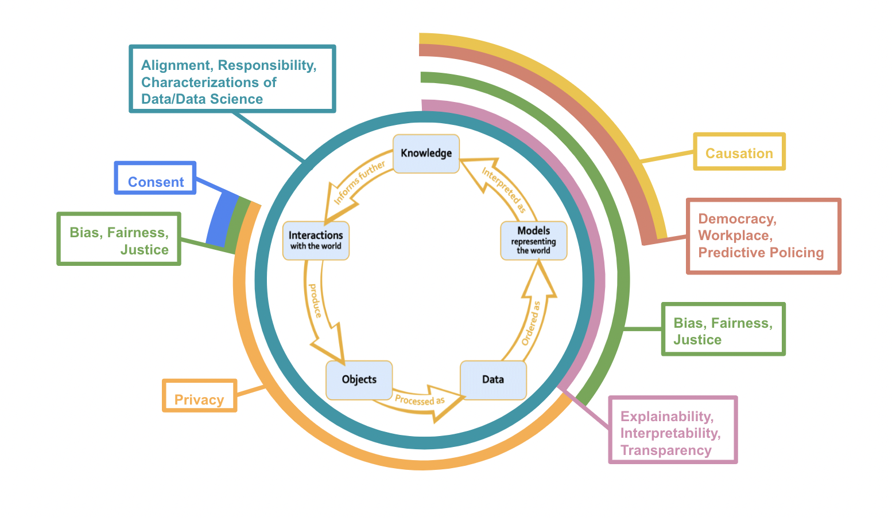
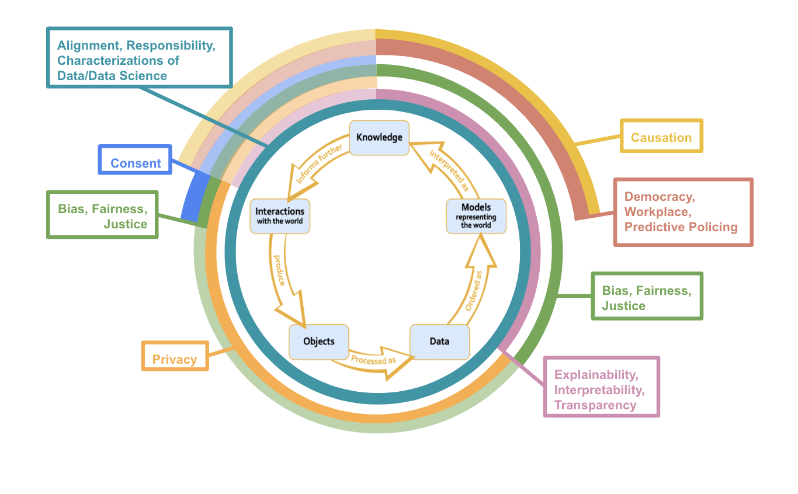

----

```{r setup, include=FALSE}
knitr::opts_chunk$set(echo = FALSE)
library(tidyverse)
library(reactable)
library(reactablefmtr)
```


```{css}
h1 {
  text-align: left;
}

.list-group-item.active, .list-group-item.active:focus, .list-group-item.active:hover {
    z-index: 2;
    color: #fff;
    background-color:  #877e2c;
    border-color:  #877e2c;
}
```

----

# Common Syllabi Topics

----

```{r message=FALSE, warning=FALSE, fig.align='center', fig.cap="Most Common Syllabi Topics Arranged in Descending Order by Count"}
syllabi_topics <- readr::read_csv("syllabi-topics.csv")

syllabi_topics %>%
  group_by(Syllabi_Topics) %>%
  count() %>%
  arrange(desc(n)) %>%
  rename(Count = n) %>%
  filter(Count > 2) %>% 
  reactable(
    columns = list(Syllabi_Topics = colDef("Syllabi Topic"),
    Count = colDef("Count")),
    highlight = TRUE,
    showSortable = TRUE,
    showPagination = TRUE,
    searchable = TRUE,
    defaultPageSize = 8,
    width = 800,
    theme = reactableTheme(
             highlightColor = "#F0EDD1",
             style = list(
      fontFamily = "-apple-system, BlinkMacSystemFont, Segoe UI, Helvetica, Arial, sans-serif"
             )))
```

----

# Lifecycle Locations of the Most Common Syllabi Topics 

----

<span style="color:#877e2c; background-color: #F0EDD1; border: 3px solid #F0EDD1; border-radius: 4px;">**'Most Common' = has a count of 3 or more**</span>
<br>

## Lifecycle 1

<ul> I considered paradigmatic ethical issues that relate to each most common topic to place them on the Data Science lifecycle:</ul>

<br>


```{r results='hide'}
most_common <- syllabi_topics %>%
  group_by(Syllabi_Topics) %>%
  count() %>%
  arrange(desc(n)) %>%
  rename(Count = n) %>%
  filter(Count >= 3)

most_common_topics <- most_common$Syllabi_Topics
```

```{r dpi= 1500, fig.align='center', echo = FALSE, out.width='110%', out.height='90%', fig.cap = "<br>This diagram helps us understand which stages or processes of the Data Science lifecycle are represented in the syllabi and which stages or processes are (generally) underrepresented in the syllabi. Importantly though, there are arguments to be made for why the most common topics should overlap with other stages of the lifecycle too.", fig.alt = "this is the data science lifecycle diagram with rings around it that represent the connections between the ethical issues and the lifecycle. The connections between the ethical issues and the lifecycle are described in section 3:'Connections'." } 

```


----

## Lifecycle 2

Rings with less opacity denote areas where there seems to be substantial overlap between common topics and the data science stage though these considerations are not "paradigmatic" ethical issues.

```{r dpi= 1500, fig.align='center', echo = FALSE, out.width='100%', out.height='90%', fig.cap = "This diagram helps us understand which stages or processes of the Data Science lifecycle are represented in the syllabi and which stages or processes are (generally) underrepresented in the syllabi. The components with less opacity are areas of overlap between syllabi topics and data science stages that are less commonly thought of within data science literature", fig.alt = "this is the data science lifecycle diagram with rings around it that represent the connections between the ethical issues and the lifecycle. The connections between the ethical issues and the lifecycle are described in section 3:'Connections'"} 

```


----

# Connections

----

This section is meant to give some brief justifications for my placement of the most common syllabi topics on the data science lifecycle in the diagram above. As with most topics in *both* data science and ethics, there is so much nuance that I cannot possibly capture in a few paragraphs. I recommend going through the readings linked below to understand more intricacies and applications of the connections between data science practices and the ethical issues that I begin to explicate below.

----

## Consent

----

Generally, when people think about consent in data science, they think about it in data collection. That is, did the researchers or business have informed consent when collecting people's data? Usually, when researchers or companies get permission to collect people's data, they also ask for consent to use the data in a specific capacity later in the lifecycle (e.g., to build models, be placed in a database, sell to another company, etc.).

Yet, an agent must also consent to have the knowledge interpreted from a data model applied to them, even if none of their data was collected for the model building. For example, imagine that a company creates a data model that predicts that people who watch a certain television show are more likely to vote for a particular presidential candidate based on previously observed cases. A person begins watching the television show, and none of their information was used in building the predictive data model. Still, it seems crucial to consider if the person gave informed consent to have the model make predictions about them and their likelihood of voting for a particular presidential candidate.

<br>

<a style="color:#877e2c; background-color: #F0EDD1; border: 5px solid #F0EDD1; border-radius: 4px;" href="Consent.html">**Consent Readings**</a>

<br>

----

## Privacy

----

In 2016, university researchers published personal data from the OkCupid dating site to an open data repository. This data revealed intimate details about over 70,000 users, including usernames, sexual preferences, and personal opinions. A scholar at Carnegie Mellon University said about 30% of these profiles were directly identifiable, meaning their OkCupid profile data could be connected to their real name, causing international outrage [@OkCupid]. The OkCupid case study underscores why data science ethics courses heavily emphasize privacy's importance. Data science often requires massive amounts of data and, as aforementioned, informed consent to be collected. Intuitively, it is unethical for personal data that people usually consented to be used by a particular entity for a specific purpose to be available to other entities, especially when the available data is identifiable (i.e., traceable back to them). 

Therefore, privacy is central to interactions with the world that lead to data collection, processing, and data storage, especially when the information collected is personal. Usually, data is aggregated and thus anonymized to develop a model, so there are typically no concerns about the model or its predictions exposing personal information.

When knowledge inferred from a data model informs further interactions with the world, worries about privacy resurface. For instance, imagine a data model by one company predicts that you are unqualified for a job. It would be unethical for this prediction to be shared with every other company you applied to or for your prediction to be given to career development companies to target course advertisements toward you. Hence, just like personal data, it seems like people have a right to keep model predictions about them private.

<br>

<a style="color:#877e2c; background-color: #F0EDD1; border: 5px solid #F0EDD1; border-radius: 4px;" href="Privacy.html">**Privacy Readings**</a>

<br>

----

## Explainability, Interpretability, Transparency

----

A common complaint about data science models, particularly more advanced ones, is that they are black boxes. Explainability, interpretability, and transparency all describe similar desires for data science technologies to be more understandable to humans, particularly the technology’s stakeholders. People usually demand that data science technologies are comprehensible to humans at the deployment stage, where predictions about individuals or groups are made. For example, if an inmate’s bail is set higher than they think it should be because an algorithm recommended the higher bail amount, it seems highly likely that the inmate would be upset. Some would argue that the inmate’s upsetness is partly because they have a right to an explanation. 

The “right to an explanation” argument extends to future interactions with our world. Imagine law enforcement starts over-policing neighborhood A relative to neighborhood B because people in neighborhood A tend to have higher bail amounts than people in neighborhood B. It seems that the people in neighborhood A have a right to know why they are being over-policed relative to the people in neighborhood B. 

Like many data science ethics terms, what exactly explainability, interpretability, and transparency require is an open question. It does not seem sufficient to publish the model’s code because this does not tell us why the model made the decision it did on a particular person. Simultaneously, more advanced data science models can use millions of hyper-parameters to make predictions. So, we cannot point to a single variable and say that it caused the algorithm to predict class X over class Y for Individual I.  

<br>

<a style="color:#877e2c; background-color: #F0EDD1; border: 5px solid #F0EDD1; border-radius: 4px;" href="Explainability.html">**Explainability, Interpretability, and Transparency Readings**</a>

<br>

----

## Democracy, Workplace, Predictive Policing

----

Democracy, workplace, and predictive policing are settings where data science practices have exceptionally high moral stakes. As such, case studies from democracy, workplace, or predictive policing settings are routinely used in data science ethics classes to underscore how pernicious data science's moral harms can be. Usually, when case studies are referenced, it concerns deploying predictive models in these settings. The COMPAS algorithm, which predicted an inmate's risk of being reconvicted to determine their sentence length, is a well-known example of an algorithm that was scrutinized for being deployed in courtrooms, given that it predicted a higher proportion of false high-risk appraisals for Black men than White men [@COMPAS].

Furthermore, these predictions can lead to morally problematic interactions with the world. For instance, suppose that law enforcement starts over-policing a predominantly Black neighborhood because a recidivism algorithm predicted that people from that neighborhood are more likely to be reconvicted of a crime. Yet, the recidivism algorithm was trained on historical data riddled with racial biases. Over-policing that neighborhood could lead to specific populations being wrongfully convicted or more likely to be convicted solely because of their demographic characteristics -- both of which are intuitively morally problematic.

Interestingly, even though there is a high likelihood of immoral outcomes of deploying predictive models in democracy, workplace, and predictive policing settings, creating these predictive models is not intuitively morally problematic in itself. Imagine that a civil rights group develops an algorithm to predict a person's likelihood of being reconvicted to show that the criminal justice system is racially biased, which intuitively, does not seem morally troublesome. Though, if the recidivism algorithm is deployed, meaning it influences people's beliefs about a person's reconviction risk, does it become morally pernicious. 

<br>

<a style="color:#877e2c; background-color: #F0EDD1; border: 5px solid #F0EDD1; border-radius: 4px;" href="Democracy.html">**Democracy Readings**</a>

<a style="color:#877e2c; background-color: #F0EDD1; border: 5px solid #F0EDD1; border-radius: 4px;" href="Workplace.html">**Workplace Readings**</a>

<a style="color:#877e2c; background-color: #F0EDD1; border: 5px solid #F0EDD1; border-radius: 4px;" href="Predictive-Policing.html">**Predictive Policing Readings**</a>

<br>

----

## Causation

----

Probably the most-known lesson in statistics is that "correlation does not imply causation". This lesson becomes especially poignant when a model representing the world is interpreted as knowledge. At least currently, most models only identify correlations between the predictor variables and the response variable, not causation (there is also centuries worth of philosophical debates about how to define causation). Interpreting correlative relationships as causal can have significant moral repercussions. For instance, suppose we have a logistic model that predicts whether a person will drop out of high school. Our model has a positive correlation between having Spanish as your first language and your expected probability of dropping out (i.e., if your first language is Spanish, you are expected to have a higher chance of dropping out of high school, holding all other variables constant). Clearly, several confounding variables, such as socioeconomic status and available academic opportunities, lead to the positive relationship we found. But, suppose that someone took our model and, from it, declared that having Spanish as your first language causes a higher probability of dropping out of high school. They might conclude that people whose first language is Spanish are less intelligent or lazier in school than those whose first language is not Spanish, leading to racist beliefs and actions that morally harm people whose first language is Spanish. Therefore, several data science ethics classes focus on causation at the knowledge-interpretation stage and, specifically, how it is dangerous to interpret causal relationships from most data models.

There can also be ethical repercussions of false causal relationships between predictors and the response variable in informing future interactions with the world. Imagine biologists theorize that native Spanish speakers are naturally less intelligent than native English speakers and use false causal claims they took from our model to justify data collection. Thus, ethical worries related causation span not just what we should interpret as knowledge from a data model but also what sorts of interactions with the world are can be justified on the basis of previously interpreted knowledge.

<br>

<a style="color:#877e2c; background-color: #F0EDD1; border: 5px solid #F0EDD1; border-radius: 4px;" href="Causation.html">**Causation Readings**</a>

<br>

## Bias, Fairness, Justice

----


<br>

<a style="color:#877e2c; background-color: #F0EDD1; border: 5px solid #F0EDD1; border-radius: 4px;" href="Bias.html">**Bias, Fairness, Justice Readings**</a>

<br>

----

## Alignment, Responsibility, Characterizations of Data and Data Science

----


<br>

<a style="color:#877e2c; background-color: #F0EDD1; border: 5px solid #F0EDD1; border-radius: 4px;" href="Alignment.html">**Alignment Readings**</a>

<a style="color:#877e2c; background-color: #F0EDD1; border: 5px solid #F0EDD1; border-radius: 4px;" href="Responsibility.html">**Responsibility Readings**</a>

<a style="color:#877e2c; background-color: #F0EDD1; border: 5px solid #F0EDD1; border-radius: 4px;" href="Characterizations.html">**Characterizations of Data and Data Science Readings**</a>

----

# References

----


