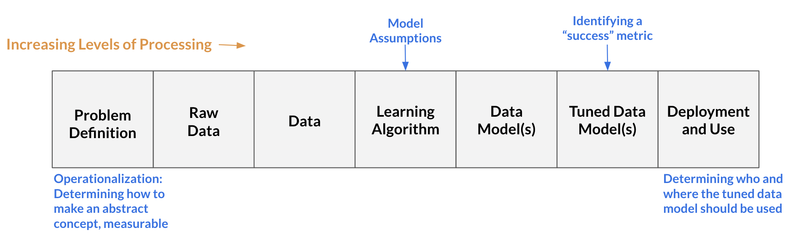

```{r setup, include=FALSE}
knitr::opts_chunk$set(echo = FALSE, fig.align = "center")
```


```{css, echo=FALSE}
h1 {
  text-align: left;
}

.list-group-item.active, .list-group-item.active:focus, .list-group-item.active:hover {
    z-index: 2;
    color: #fff;
    background-color:  #877e2c;
    border-color:  #877e2c;
}
```

Comic via [Evil AI Cartoons](https://www.evilaicartoons.com/):

```{r out.width = '100%', out.height='20%'}
knitr::include_graphics("images/AI-ethics.jpg")
```


----

# What is Data Science?

----

### Data Science Definition

Data Science is typically focused on transforming the data into data model(s), but data science encompasses the *all the stages* needed to answer questions with data: from "Problem Definition" to "Deployment and Use". 

```{r}
knitr::include_graphics("images/DS-stack.png")
```

* **Problem Definition:** asks what is the problem? What counts as success (i.e., when do we say a data model is successful)? How can we actually measure (or approximately measure) our event-of-interest?

* **Raw Data:** the information collected from the world. For example, if we are interested in which baby names are popular in the US during the 2010s, our raw data might be the birth certificates for babies born between 2010 and 2019 in the US.  

* **Data:** the processed form of the raw data, often involving taking the raw data and formatting it as a data table. For example, data would be the birth certificate information put into a data frame in which each row represents a baby born in the US during the 2010s and the columns are different features-of-interest for that baby (e.g., their name, birth year, and sex).

* **Learning Algorithm:** a mathematical formula that predicts an output from an input. Learning algorithms range from simple linear regression to neural networks with millions of hyperparameters.

* **Data Model(s):** an output created by running the data through selected learning algorithm that aims to generalize the relationship between variables in the data. For example, simple linear regression, $\mathbb{E}(Y_i|x_i) = \beta_0 + \beta_1(x_i)$, is a data model that generalizes a  relationship between *x* and the expected value of *Y* (given *x*) as linear.

* **Tuned Data Model(s):** a data model in which the model's parameters are adjusted, usually to better balance the model's generalizablity and (prediction) accuracy for the population-of-interest. In practice, the tuning is done either through splitting the data into training and test sets or performing cross-validation.

* **Deployment and Use:** generation of predictions (or other output) from the tuned data model. This is the stage where we ask questions like where should the system be used, who should be using it, and who/what should the data model be used on?

----

# What is Ethics?

----

### Ethics Definition

Ethics (also referred to as moral philosophy) is comprised of three main branches:

1. **Applied Ethics:** concerns the treatment of "moral problems, practices, and policies in personal life, professions, technology, and government," [@applied-ethics].

<ul>**E.g.,** *Is it morally permissible to deploy predictive-policing algorithms? When (if ever) is it morally permissible to let someone die?*</ul>

2. **Ethical Theory:** concerns "the articulation and justification of the fundamental moral principles that govern how we should live and what we ought to morally do," [@ethical-theory].

<ul>**E.g.,** *What ought we value? What moral principles ought to guide our actions?*<br>Ethical theory is where higher-level moral principles, such as [consequentialism](https://plato.stanford.edu/entries/consequentialism/) (such as utilitarianism), [deontological ethics](https://plato.stanford.edu/entries/ethics-deontological/) (such as Kantian ethics), and [virtue ethics](https://plato.stanford.edu/entries/ethics-virtue/) are explicated and justified.</ul>  

3. **Metaethics:** explores "the status, foundations, and scope of moral values, properties, and words," [@metaethics].

<ul>**E.g.,** *What does it mean to invoke one's hypothetical will? What is morality?*</ul>

A key takeaway is that ethics attempts to answer *normative* questions. For instance, ethics attempts to answer not what person A values, but rather what person A *should* value? Similarly, ethics is interested in what decision person A *should* act and not what act person A makes (or is likely to make). 

Another important distinction is between ethics and the law. Ethics is not interested in legal normative claims, that is, in identifying trade-offs between values or actions from the perspective of legal norms. Moral and legal normative claims can come apart. For example, it seems morally impermissible to cheat on a romantic partner you are in a monogamous relationship with, even though it is legal.

### Relevant Ethics Vocabulary

* **(Moral) Right:** an entitlement "(not) to perform certain actions, or (not) to be in certain states" based on a moral justification [@sep-rights]. For example, a person's right choose what they do with their body is based on the moral principle that one's autonomy ought to be respected. Notably, rights can be waived, forfeited, or overridden. More information available in this [Stanford Encyclopedia of Philosophy entry](https://plato.stanford.edu/entries/rights/).

* **(Moral) Duty:** B has a duty to give X to A *if and only if* A has right to be given X by B. Given rights can be forfeited, waived, and overridden, A's duty to give X to B might exist at $t_1$ but no longer exist at $t_2$.

* **Stakeholder:** those who could be impacted by a decision. Usually, we have to pare down to stakeholders we think have the most relevant interests during ethical analysis.

----

# Why Data Science Ethics?

----

Data Science Ethics is usually considered an example of Applied Ethics. Though, case studies in Data Science Ethics can also influence our answers to Ethical Theory and Metaethics questions too.

### Data Science Ethics Definition

Per @DS-ethics-def:

**Data Science Ethics** studies and evaluates moral problems related to:

* **Data** including generation, recording, processing, dissemination, and sharing

* **Algorithms** including artificial intelligence, machine learning and statistical learning

* **Corresponding Practices** including responsible innovation, programming, hacking, and professional codes

in order to formulate and support morally good solutions (e.g. right conducts or right values).

### Importance of Data Science Ethics

There are a number of critical decision-points in data science, which can lead to moral problems in data, algorithms, and corresponding practices.

**Here are just some of the key decision-points in data science:**
<br>

```{r}

```


<br>
Given the commonly-held belief that math, and consequently statistics, is "objective" (in the sense that it is not influenced by one's moral values), these potentially morally-charged choices are often made implicitly, without the decision-maker reflecting on, for example, how opting for *Choice A* over *Choice B* (mis)aligns with their moral values and/or duties to stakeholders. 

Data Science Ethics attempts to illuminate the ethical repercussions of these choices and take an interdisciplinary perspective on aligning our moral values and duties with our data science practices. 

<p style="background-color: #ededed; border: 5px solid #ededed;">**Therefore, understanding Data Science Ethics is critical to ensuring morally responsible data science practices and becomes even more essential as our decisions become increasingly influenced by data science.**</p>

---

# References

---

*Beyond formal references, I also owe many ideas from my ethics classes with Julie Tannenbaum, Associate Professor of Philosophy at Pomona College and the workshops from [Intelligence, Data, And Society (IDEAS) Summer Program](https://sites.google.com/view/ideas-summer-program/) at the University of California, San Diego in Summer 2023.*