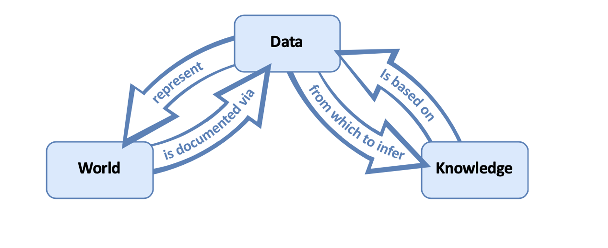
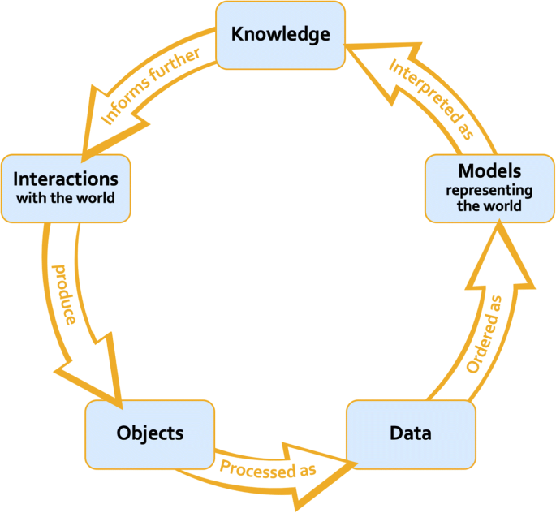
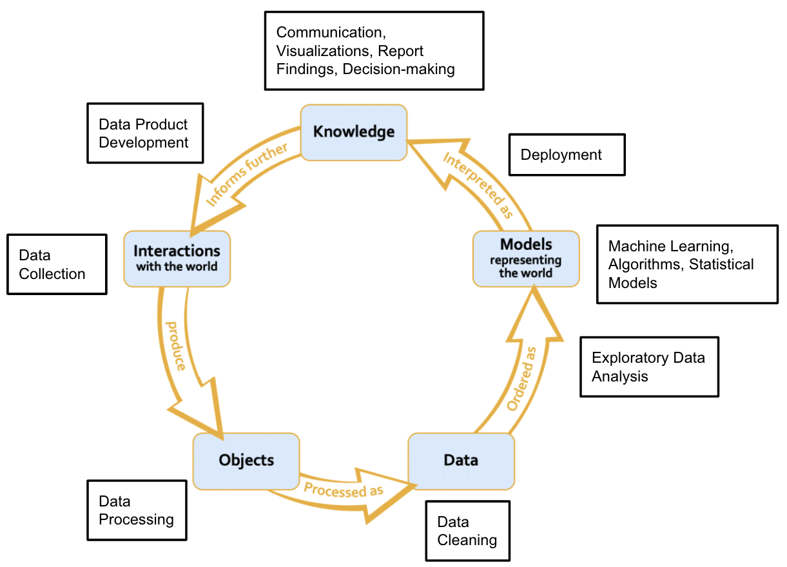

----

```{r setup, include=FALSE}
knitr::opts_chunk$set(echo = FALSE)
library(tidyverse)
library(reactable)
library(reactablefmtr)
```

```{css}
h1 {
  text-align: left;
}

.list-group-item.active, .list-group-item.active:focus, .list-group-item.active:hover {
    z-index: 2;
    color: #fff;
    background-color:  #877e2c;
    border-color:  #877e2c;
}
```

<p style="background-color: #ededed; border: 5px solid #ededed;">
**A Data Science Lifecycle or Pipeline:** a diagram that depicts a relationship between different stages of data science (e.g., data collection, data cleaning, model-building).
</p>

Though it might not be explicit, using one lifecycle or pipeline over another endorses specific views about data, data models, and their respective relationships to what we take to be knowledge about our world. Thus, the choice to use a certain data science lifecycle is **value-laden**.  

There are two popular conceptions of the relationships between data, data models, and what we should interpret as knowledge about our world (i.e., the epistemic roles of data and data models) [@Leonelli]:

1. **The representational view of data and data models**

2. **The relational view of data and data models**

<p style="background-color: #ededed; border: 5px solid #ededed;">
**Data Models:**  "arrangements of data that are evaluated, manipulated and modified with the explicit goal of representing a phenomenon, which is often (though not always) meant to capture specific aspects of the world," [@Leonelli].<br><br>**Examples of Data Models:**<br><br>1. A simple linear regression that uses years of education to model the expected income is a data model.<br><br>2. An algorithm that utilizes millions of hyperparameters to predict an incarcerated individual’s risk of recidivism.<br><br>3. A data visualization that describes a relationship between variables within a sample.
</p>

In the following two subsections, I provide an explication of the representational and relational view of data and data models and some reasoning for why we ought to reject the representational view of data and data models in favor of the relational one. I recommend reading @Leonelli for a more in-depth justification of the value of a relational view of data and data models over a representational one.  

----

# The Representational View

----

Under the representational view of data and data models, the informational content of data is fixed and independent of the researchers’ background assumptions and context. Thus, data models are important only insofar as they extract the truth from the data. Hence, under the representational view, models are either objectively correct or incorrect, depending on their ability to elucidate the truth stored in the data. In other words, data models are only relevant because they clarify the arrows between data and knowledge in the diagram below [@Leonelli].

```{r dpi= 500, fig.align='center', echo = FALSE, out.width='70%', out.height='70%', fig.alt="Data Science Lifecycle under the Representational View of Data and Models described by Sabina Leonelli in 2019. The lifecycle is represented as a circle with 3 components that all interact with one another. The components include: (1) World, (2) Data, and (3) Knowledge. (1) World is documented via (2) Data and (2) Data represents (1) World. Additonally, (3) Knowledge is based on (2) Data and (2) Data is used to infer (3) Knowledge.", fig.cap = "Data Science Lifecycle under the Representational View of Data and Models described by Sabina Leonelli in 2019. Any processing of the data, data organizing, or data modeling would merely be a tool to elucidate the connection between Data and Knowledge and the World."}

```


----

# The Relational View

----

Meanwhile, under the relational view of data and data models, data is understood as any object treated as evidence for at least one claim about the world and "is possible to circulate…among individuals/groups," [@Leonelli]. Consequently, the informational content of data depends on the researchers’ background assumptions and social context. So, truth is not stored in data and is instead defined by its social environment and the function it is supposed to serve. As such, data models, not data, serve as representations of our world, making data models necessary and highly influential to knowledge production under the relational view of data and data models [@Leonelli].


```{r dpi= 500, fig.align='center', echo = FALSE, out.width='50%', out.height='50%', fig.alt="Data Science Lifecycle under the Relational View of Data and Models conceptualized by Sabina Leonelli in 2019. The lifecycle is represented as a circle with 5 stages. The stages of inquiry include: (1) 'Interactions with the World', which produce (2) 'Objects', which are processed as 'Data', which are ordered as (4) 'Models representing the World', which is then interpreted as (5) 'Knowledge'. What is interpreted as (5) 'Knowledge' further informs (1) 'Interactions with the World'.", fig.cap = "Data Science Lifecycle under the Relational View of Data and Models conceptualized by Sabina Leonelli in 2019."}

```


----

# The Relational vs. Representational View In-Practice

---

Consider how soccer match data influences our valuation of the match’s players (i.e., the phenomenon we are interested in understanding).

**From the representational view of data and data models:** the data inherently represents the actual soccer matches and players’ values. As such, questions about the data are solely focused on whether it is good enough. For instance, we may wonder if the sensors on the pitch are calibrated correctly.

**Meanwhile, from the relational view of data and data models:** data is only evidence in virtue of how it is organized. In turn, we would question why specific data should be evidence of a player’s value and how the larger social environment influences what data is generated. For instance, we may ask if data about the percentage of passes completed or kilometers run is better evidence of a soccer player’s value given our data model or how social contexts, like the role of FIFA videogames or social media, influence perceptions of soccer and data generation [@Beaulieu-Leonelli,59]. 

Such an example shows data in itself is *representationally ambiguous* and is dependent on its broader social environment. For instance, it is unclear what the sensors should be calibrated for, especially if calibration for foot speed reduces calibration for ball location, et cetera. There are many other questions that the representational view of data and data models neglects, such as which data model should be used and which variables (i.e., components of data) should be used within a given data model. Researchers must rely upon their background assumptions, knowledge, value judgments, and social contexts to answer these questions and, thus, what data is taken as evidence.

<p style="background-color: #ededed; border: 5px solid #ededed;">**Therefore, this case study gives us reason to reject the representational view of data and data models in favor of the relational view of data and data models.**</p>

----

### Silberzahn et al.'s "Many Analysts, One Data Set: Making Transparent How Variations in Analytic Choices Affect Results"

In @soccer-case, 29 data analysis teams were asked to use the same data set to determine "whether soccer referees are more likely to give red cards to dark-skin-toned players than light-skin-toned players,". Despite operating from the same data set, the final conclusions were split: 20 teams found that there was a statistically significant positive relationship, and 9 teams did not find a significant association between skin tone and the likelihood of the referee giving a red card. 

The difference in chosen data model type and the relative importance of the potential predictor variables contributed to the division in the teams’ final decisions:

* 4 different model types were used: 15 teams used logistic models, 6 teams used Poisson models, 6 teams used linear models, and 2 teams used other types of models.

* 21/29 teams used unique combinations of predictor variables.


Through @soccer-case, we can also see how ambiguity about the data model and the relative importance of certain predictor variables also impacts what data is taken as evidence. No two teams had the same set of evidence for their claim about the relationship between skin tone and the likelihood of the referee giving a red card. As emphasized by @soccer-case,  each team’s evidence set was defensible based on the original data set provided. Yet, these evidence sets were also subjective in the sense that they relied upon the analysts’ background assumptions, value judgments, knowledge, and social contexts.

<p style="background-color: #ededed; border: 5px solid #ededed;">**Hence, @soccer-case emphasize that data and data models should be viewed relationally rather than representationally.**</p> 


----

# The Final Data Science Lifecycle

----

The final data science lifecycle endorses the relational view of data and data models proposed by @Leonelli. The diagram below shows us where paradigmatic data science practices occur in the lifecycle [@Beaulieu-Leonelli, 58].

```{r dpi= 500, fig.align='center', echo = FALSE, out.width='80%', out.height='80%', fig.alt="Data Science Lifecycle under the Relational View of Data and Models conceptualized by Sabina Leonelli in 2019. The lifecycle is represented as a circle with 5 stages. Data Collection belongs to (1) Interactions with the World. Data Processing creates (2) Objects. Data Cleaning produces (3) Data. Exploratory Data Analysis is an intermediary between (3) Data and (4) Models. Machine Learning, Algorithms, Statistical Models are paradigmatic examples of (4) Models representing the World. Deployment of (4) Models creates interpretations of (5) Knowledge, which includes Communication, Visualizations, Report-Findings, and Decision making. Finally, (5) Knowledge informs further (1) Interactions with the world via Data Product Development.", fig.cap = "Data Science Lifecycle under the Relational View of Data and Models Superimposed with Paradigmatic Data Science Practices [@Beaulieu-Leonelli, 58]."}

```

---

# References

---